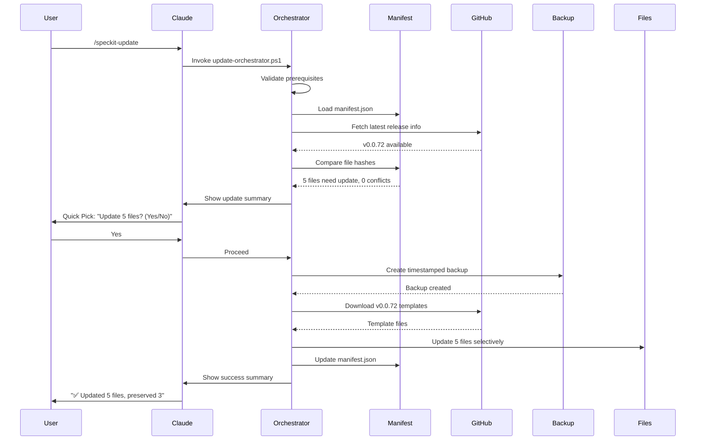
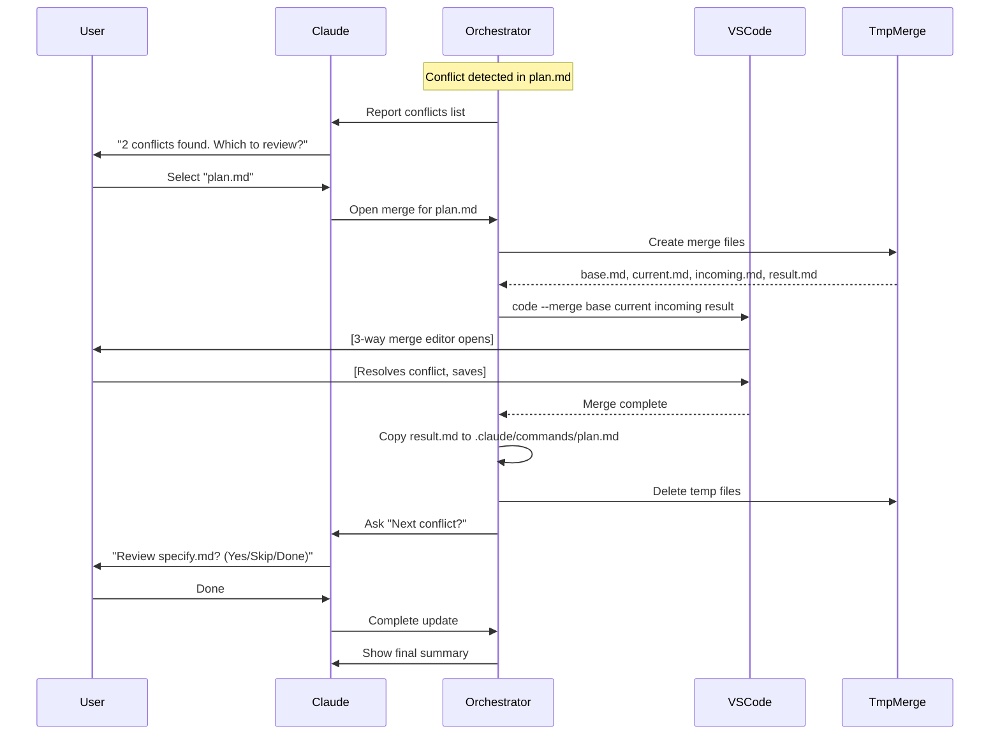
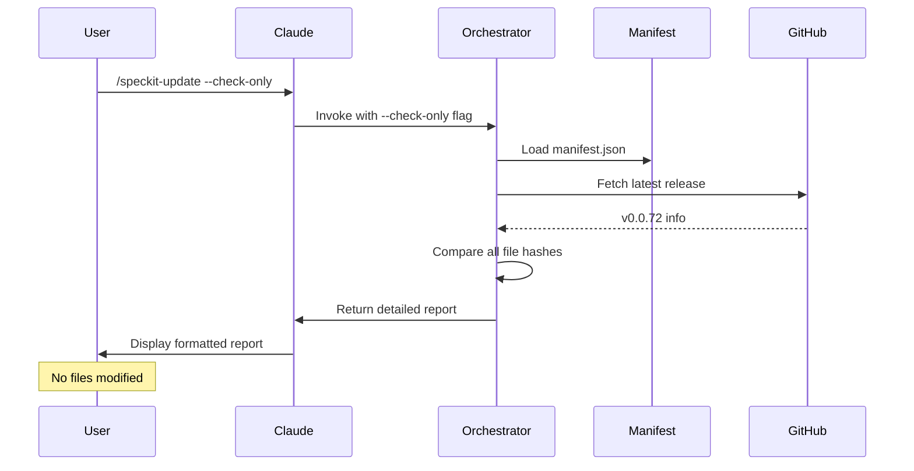
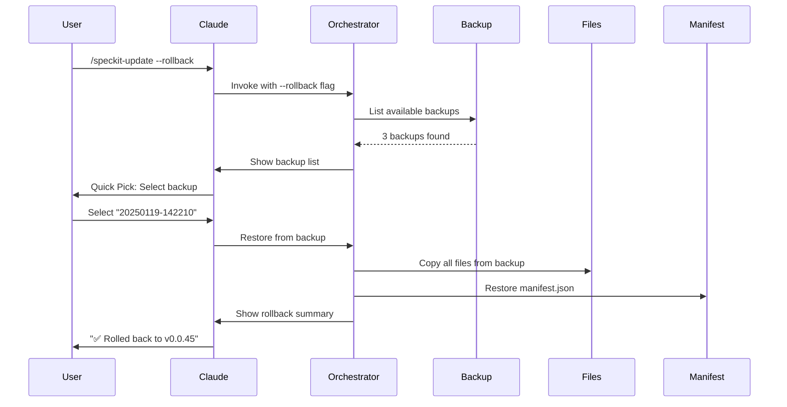
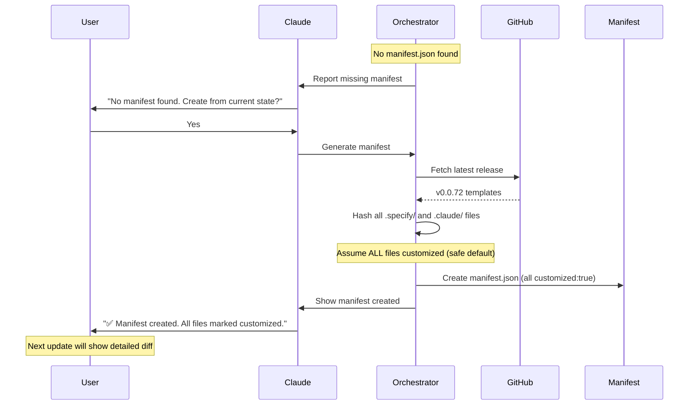

# Specification: SpecKit Safe Update Claude Code Skill

## Overview

**Feature Name:** SpecKit Safe Update Skill
**Skill Command:** `/speckit-update`
**Target Platform:** Claude Code (VSCode Extension)
**Language:** PowerShell 7+
**Distribution:** GitHub Repository

**Purpose:** Provide a safe, automated way to update SpecKit templates, commands, and scripts while preserving user customizations, eliminating the need for destructive `specify init --force` updates.

## User Stories

### US-1: Safe Update with Customizations
**As a** developer with customized SpecKit commands
**I want to** update to latest templates without losing my customizations
**So that** I can get bug fixes while keeping my team's workflows

**Acceptance Criteria:**
- Command identifies which files are customized vs. default
- Update process preserves customizations automatically
- Custom commands in `.claude/commands/` are not overwritten
- Dry-run mode shows exactly what will change
- Constitution updates handled via `/speckit.constitution` integration

### US-2: Version Awareness and Tracking
**As a** team lead coordinating multiple developers
**I want to** know which SpecKit version each project uses
**So that** we can ensure consistency across the team

**Acceptance Criteria:**
- Command reports current installed SpecKit version (release tag)
- Command reports available updates from GitHub Releases
- Version information stored in `.specify/manifest.json`
- Manifest committed to Git for team consistency

### US-3: Intelligent Conflict Resolution
**As a** developer who customized templates
**I want to** see conflicts between my changes and new templates
**So that** I can merge them intelligently using VSCode tools

**Acceptance Criteria:**
- Command detects when user-modified files have upstream changes
- Lists conflicts clearly with file paths and descriptions
- Opens VSCode 3-way merge editor for conflict resolution
- Guides user through conflicts one at a time (Flow A)
- Temporary merge files cleaned up automatically

## Technical Specification

### Architecture

```
┌─────────────────────────────────────────────────────────┐
│ Claude Code Extension                                   │
│ - Invokes /speckit-update command                       │
│ - Presents Quick Pick UI for user choices               │
│ - Passes decisions to PowerShell scripts                │
└───────────────────┬─────────────────────────────────────┘
                    │
                    ▼
┌─────────────────────────────────────────────────────────┐
│ update-orchestrator.ps1                                 │
│ - Main entry point                                      │
│ - Validates prerequisites                               │
│ - Coordinates all update steps                          │
│ - Handles rollback on failure                           │
└───────────────────┬─────────────────────────────────────┘
                    │
        ┌───────────┴───────────┬───────────────┐
        ▼                       ▼               ▼
┌──────────────────┐  ┌──────────────────┐  ┌──────────────────┐
│ manifest-mgr.ps1 │  │ conflict-det.ps1 │  │ backup-mgr.ps1   │
│ - Version detect │  │ - Hash compare   │  │ - Create backup  │
│ - Manifest CRUD  │  │ - Detect customs │  │ - Rollback       │
│ - GitHub API     │  │ - Track official │  │ - Retention mgmt │
└──────────────────┘  └──────────────────┘  └──────────────────┘
```

### File Structure

```
speckit-updater/                                    # GitHub repository root
├── SKILL.md                                        # Claude Code skill definition
├── README.md                                       # Installation and usage
├── LICENSE                                         # MIT License
├── .gitignore                                      # Exclude .tmp-merge/, etc.
│
├── scripts/
│   ├── update-orchestrator.ps1                    # Main orchestrator (entry point)
│   ├── modules/
│   │   ├── ManifestManager.psm1                   # Manifest operations module
│   │   ├── ConflictDetector.psm1                  # Customization detection module
│   │   ├── BackupManager.psm1                     # Backup/rollback module
│   │   ├── GitHubApiClient.psm1                   # GitHub Releases API client
│   │   ├── HashUtils.psm1                         # Normalized hashing utilities
│   │   └── VSCodeIntegration.psm1                 # Context detection, code CLI
│   └── helpers/
│       ├── Get-ExecutionContext.ps1               # Detect VSCode vs terminal
│       ├── Invoke-PreUpdateValidation.ps1         # Prerequisites check
│       └── Show-UpdateSummary.ps1                 # Format output messages
│
├── templates/
│   └── manifest-template.json                     # Default manifest structure
│
└── tests/
    ├── unit/
    │   ├── ManifestManager.Tests.ps1
    │   ├── ConflictDetector.Tests.ps1
    │   ├── BackupManager.Tests.ps1
    │   ├── GitHubApiClient.Tests.ps1
    │   └── HashUtils.Tests.ps1
    ├── integration/
    │   └── UpdateOrchestrator.Tests.ps1
    └── fixtures/
        ├── sample-project-with-manifest/
        ├── sample-project-without-manifest/
        ├── sample-project-with-customizations/
        └── mock-github-responses/
```

### Data Model

#### Manifest File (`.specify/manifest.json`)

```json
{
  "version": "1.0",
  "speckit_version": "v0.0.72",
  "initialized_at": "2025-01-19T12:34:56Z",
  "last_updated": "2025-01-19T14:22:10Z",
  "agent": "claude-code",
  "speckit_commands": [
    "speckit.constitution.md",
    "speckit.specify.md",
    "speckit.clarify.md",
    "speckit.plan.md",
    "speckit.tasks.md",
    "speckit.implement.md",
    "speckit.analyze.md",
    "speckit.checklist.md"
  ],
  "tracked_files": [
    {
      "path": ".claude/commands/speckit.specify.md",
      "original_hash": "sha256:abc123...",
      "customized": false,
      "is_official": true
    },
    {
      "path": ".specify/memory/constitution.md",
      "original_hash": "sha256:def456...",
      "customized": true,
      "is_official": true
    }
  ],
  "custom_files": [
    ".claude/commands/custom-deploy.md",
    ".claude/commands/run-security-scan.md"
  ],
  "backup_history": [
    {
      "timestamp": "2025-01-19T14:22:10Z",
      "path": ".specify/backups/20250119-142210",
      "from_version": "v0.0.45",
      "to_version": "v0.0.72"
    }
  ]
}
```

**Schema Validation:**
- `version`: Manifest schema version (currently "1.0")
- `speckit_version`: Release tag (e.g., "v0.0.72")
- `speckit_commands`: List of official command filenames
- `tracked_files[].path`: Relative path from project root
- `tracked_files[].original_hash`: SHA-256 of original file (normalized)
- `tracked_files[].customized`: Boolean, true if hash differs from original
- `tracked_files[].is_official`: Boolean, true if part of SpecKit
- `custom_files[]`: List of user-created files (not in official SpecKit)

#### File State Object (Internal)

```typescript
interface FileState {
  path: string;
  currentHash: string;
  originalHash: string;
  upstreamHash: string;
  isCustomized: boolean;
  hasUpstreamChanges: boolean;
  isConflict: boolean;
  isOfficial: boolean;
  action: 'update' | 'preserve' | 'merge' | 'skip' | 'add' | 'remove';
}
```

### Command Interface

#### Command Signature

```powershell
/speckit-update [--check-only] [--version <tag>] [--force] [--rollback] [--no-backup]
```

#### Parameters

| Parameter | Type | Required | Description |
|-----------|------|----------|-------------|
| `--check-only` | Switch | No | Show what would change without applying updates |
| `--version` | String | No | Update to specific release tag (e.g., "v0.0.72" or "0.0.72") |
| `--force` | Switch | No | Overwrite SpecKit files even if customized (preserves custom commands) |
| `--rollback` | Switch | No | Restore from previous backup |
| `--no-backup` | Switch | No | Skip backup creation (dangerous, not recommended) |

#### Return Values

| Exit Code | Meaning |
|-----------|---------|
| 0 | Success |
| 1 | General error |
| 2 | Prerequisites not met |
| 3 | Network/API error |
| 4 | Git error |
| 5 | User cancelled |
| 6 | Rollback required (automatic) |

### Core Workflows

#### Workflow 1: Standard Update (No Conflicts)



#### Workflow 2: Update with Conflicts (Flow A)



#### Workflow 3: Check-Only Mode



**Output Format for --check-only:**

```
SpecKit Update Check
━━━━━━━━━━━━━━━━━━━━━━━━━━━━━━━━━━━━━━━
Current Version:  v0.0.45
Latest Version:   v0.0.72
Available Update: 27 versions behind

Files that would update (no conflicts):
  ✓ .specify/templates/plan-template.md
  ✓ .specify/templates/spec-template.md
  ✓ .specify/scripts/create-new-feature.sh
  ✓ .claude/commands/speckit.tasks.md
  ✓ .claude/commands/speckit.implement.md

Files with customizations (will preserve):
  → .claude/commands/speckit.specify.md (customized)
  → .specify/templates/custom-template.md (customized)
  → .specify/memory/constitution.md (customized, will use /speckit.constitution)

Conflicts detected (require manual merge):
  ⚠ .claude/commands/speckit.plan.md
    You modified: Added custom tech stack section
    Upstream changed: New architecture validation step

  ⚠ .specify/templates/tasks-template.md
    You modified: Custom task checklist format
    Upstream changed: Added dependency tracking

Custom commands (always preserved):
  ✓ .claude/commands/custom-deploy.md
  ✓ .claude/commands/run-security-scan.md

Run '/speckit-update' to apply updates.
```

#### Workflow 4: Rollback



#### Workflow 5: First-Time Manifest Generation



### Module Specifications

#### ManifestManager.psm1

**Purpose:** Manage manifest file operations (CRUD, validation).

**Functions:**

```powershell
function Get-SpecKitManifest {
    param([string]$ProjectRoot)
    # Returns: PSCustomObject or $null if not found
    # Validates schema version
    # Throws if corrupted
}

function New-SpecKitManifest {
    param(
        [string]$ProjectRoot,
        [string]$SpecKitVersion,
        [switch]$AssumeAllCustomized
    )
    # Creates new manifest.json
    # Scans .specify/ and .claude/commands/
    # Generates hashes for all files
    # Sets customized=$AssumeAllCustomized
}

function Update-ManifestVersion {
    param(
        [string]$ProjectRoot,
        [string]$NewVersion
    )
    # Updates speckit_version and last_updated
    # Preserves tracked_files and custom_files
}

function Add-TrackedFile {
    param(
        [string]$ProjectRoot,
        [string]$FilePath,
        [string]$Hash,
        [bool]$IsOfficial
    )
    # Adds new entry to tracked_files
}

function Remove-TrackedFile {
    param(
        [string]$ProjectRoot,
        [string]$FilePath
    )
    # Removes entry from tracked_files
    # Used when official SpecKit command is removed upstream
}

function Get-OfficialSpecKitCommands {
    param([string]$SpecKitVersion)
    # Fetches list of official commands from GitHub release
    # Returns: String[]
    # Caches result for performance
}
```

#### ConflictDetector.psm1

**Purpose:** Detect customizations and conflicts between versions.

**Functions:**

```powershell
function Get-FileState {
    param(
        [string]$FilePath,
        [string]$OriginalHash,
        [string]$UpstreamHash
    )
    # Returns: FileState object
    # Computes current normalized hash
    # Determines: isCustomized, hasUpstreamChanges, isConflict
}

function Get-AllFileStates {
    param(
        [PSCustomObject]$Manifest,
        [hashtable]$UpstreamTemplates
    )
    # Returns: FileState[] for all tracked files
    # Compares manifest hashes vs current hashes vs upstream hashes
}

function Test-FileCustomized {
    param(
        [string]$FilePath,
        [string]$OriginalHash
    )
    # Returns: bool
    # Uses normalized hash comparison
}

function Get-NormalizedHash {
    param([string]$FilePath)
    # Returns: SHA-256 hash string
    # Normalizes: line endings (CRLF→LF), trims trailing whitespace
    # Ignores BOM
}

function Find-CustomCommands {
    param(
        [string]$ProjectRoot,
        [string[]]$OfficialCommands
    )
    # Returns: String[] of custom command filenames
    # Scans .claude/commands/ for files not in $OfficialCommands
}
```

**Normalization Algorithm:**

```powershell
function Get-NormalizedHash {
    param([string]$FilePath)

    # Read file as bytes to handle encoding correctly
    $content = [System.IO.File]::ReadAllText($FilePath)

    # Normalize line endings: CRLF → LF
    $normalized = $content -replace "`r`n", "`n"

    # Trim trailing whitespace from each line
    $lines = $normalized -split "`n"
    $trimmedLines = $lines | ForEach-Object { $_.TrimEnd() }
    $normalized = $trimmedLines -join "`n"

    # Remove BOM if present
    if ($normalized.StartsWith([char]0xFEFF)) {
        $normalized = $normalized.Substring(1)
    }

    # Compute SHA-256 hash
    $bytes = [System.Text.Encoding]::UTF8.GetBytes($normalized)
    $sha256 = [System.Security.Cryptography.SHA256]::Create()
    $hashBytes = $sha256.ComputeHash($bytes)
    $hashString = [System.BitConverter]::ToString($hashBytes) -replace '-', ''

    return "sha256:$hashString"
}
```

#### BackupManager.psm1

**Purpose:** Create, manage, and restore backups.

**Functions:**

```powershell
function New-SpecKitBackup {
    param([string]$ProjectRoot)
    # Returns: Backup path string
    # Creates timestamped directory in .specify/backups/
    # Copies .specify/ and .claude/ recursively
    # Updates manifest.json backup_history
}

function Restore-SpecKitBackup {
    param(
        [string]$ProjectRoot,
        [string]$BackupPath
    )
    # Restores all files from backup
    # Overwrites current state
    # Updates manifest.json
}

function Get-SpecKitBackups {
    param([string]$ProjectRoot)
    # Returns: PSCustomObject[] with backup metadata
    # Sorted by timestamp (newest first)
}

function Remove-OldBackups {
    param(
        [string]$ProjectRoot,
        [int]$KeepCount = 5,
        [switch]$WhatIf
    )
    # Returns: String[] of backups to delete
    # Keeps $KeepCount newest backups
    # If -WhatIf: shows what would be deleted without deleting
}

function Invoke-AutomaticRollback {
    param(
        [string]$ProjectRoot,
        [string]$BackupPath
    )
    # Called on update failure
    # Restores from backup without user interaction
    # Logs reason for rollback
}
```

**Backup Directory Structure:**

```
.specify/backups/
├── 20250118-093045/
│   ├── .specify/
│   │   ├── manifest.json
│   │   ├── memory/
│   │   ├── templates/
│   │   └── scripts/
│   └── .claude/
│       └── commands/
├── 20250119-142210/
│   └── ... (same structure)
└── 20250119-153322/
    └── ... (same structure)
```

#### GitHubApiClient.psm1

**Purpose:** Interact with GitHub Releases API.

**Functions:**

```powershell
function Get-LatestSpecKitRelease {
    # Returns: PSCustomObject with release info
    # Endpoint: GET /repos/github/spec-kit/releases/latest
    # Handles rate limiting (60 req/hour)
}

function Get-SpecKitRelease {
    param([string]$Version)
    # Returns: PSCustomObject for specific version
    # Endpoint: GET /repos/github/spec-kit/releases/tags/$Version
}

function Get-SpecKitReleaseAssets {
    param([string]$Version)
    # Returns: PSCustomObject[] of release assets (ZIP files)
    # Filters for agent-specific assets (e.g., "claude-templates.zip")
}

function Download-SpecKitTemplates {
    param(
        [string]$Version,
        [string]$DestinationPath
    )
    # Downloads and extracts templates for Claude Code agent
    # Returns: hashtable of filename→content
}

function Test-GitHubApiRateLimit {
    # Returns: PSCustomObject with rate limit status
    # Endpoint: GET /rate_limit
    # Warns if close to limit
}
```

**API Response Handling:**

```powershell
# Example response structure
$release = @{
    tag_name = "v0.0.72"
    name = "Release v0.0.72"
    published_at = "2025-01-15T10:30:00Z"
    assets = @(
        @{
            name = "claude-templates.zip"
            browser_download_url = "https://github.com/github/spec-kit/releases/download/v0.0.72/claude-templates.zip"
            size = 245678
        }
    )
}
```

**Error Handling:**

```powershell
function Invoke-GitHubApiRequest {
    param([string]$Uri)

    try {
        $response = Invoke-RestMethod -Uri $Uri -Headers @{
            "Accept" = "application/vnd.github+json"
            "User-Agent" = "SpecKit-Update-Skill/1.0"
        }
        return $response
    }
    catch {
        if ($_.Exception.Response.StatusCode -eq 403) {
            # Rate limit exceeded
            $resetTime = $_.Exception.Response.Headers['X-RateLimit-Reset']
            throw "GitHub API rate limit exceeded. Resets at: $resetTime"
        }
        elseif ($_.Exception.Response.StatusCode -eq 404) {
            throw "Release not found: $Uri"
        }
        else {
            throw "GitHub API error: $($_.Exception.Message)"
        }
    }
}
```

#### VSCodeIntegration.psm1

**Purpose:** Detect execution context and integrate with VSCode.

**Functions:**

```powershell
function Get-ExecutionContext {
    # Returns: 'vscode-extension' | 'vscode-terminal' | 'standalone-terminal'
    # Checks: $env:VSCODE_PID, $env:TERM_PROGRAM
}

function Show-QuickPick {
    param(
        [string]$Prompt,
        [string[]]$Options,
        [switch]$MultiSelect
    )
    # In VSCode: Uses Claude Code Quick Pick (via Claude orchestration)
    # In terminal: Falls back to numbered menu with Read-Host
    # Returns: String or String[] (if MultiSelect)
}

function Open-DiffView {
    param(
        [string]$LeftPath,
        [string]$RightPath,
        [string]$Title
    )
    # Executes: code --diff "$LeftPath" "$RightPath"
    # Works from any context if VSCode is installed
}

function Open-MergeEditor {
    param(
        [string]$BasePath,
        [string]$CurrentPath,
        [string]$IncomingPath,
        [string]$ResultPath
    )
    # Executes: code --merge "$BasePath" "$CurrentPath" "$IncomingPath" "$ResultPath"
    # Blocks until merge complete
    # Returns: bool (success/failure)
}

function Show-Notification {
    param(
        [string]$Message,
        [ValidateSet('info', 'warning', 'error')]$Level = 'info'
    )
    # In VSCode: Could integrate with extension notifications
    # In terminal: Uses Write-Host with color coding
}
```

**Context Detection Logic:**

```powershell
function Get-ExecutionContext {
    if ($env:VSCODE_PID) {
        # Running inside VSCode
        if ($env:TERM_PROGRAM -eq 'vscode') {
            return 'vscode-terminal'
        }
        else {
            return 'vscode-extension'
        }
    }
    else {
        return 'standalone-terminal'
    }
}
```

### Update Orchestrator (Main Script)

**File:** `scripts/update-orchestrator.ps1`

**High-Level Flow:**

```powershell
#Requires -Version 7.0

[CmdletBinding()]
param(
    [switch]$CheckOnly,
    [string]$Version,
    [switch]$Force,
    [switch]$Rollback,
    [switch]$NoBackup
)

# Import modules
Import-Module "$PSScriptRoot/modules/ManifestManager.psm1"
Import-Module "$PSScriptRoot/modules/ConflictDetector.psm1"
Import-Module "$PSScriptRoot/modules/BackupManager.psm1"
Import-Module "$PSScriptRoot/modules/GitHubApiClient.psm1"
Import-Module "$PSScriptRoot/modules/VSCodeIntegration.psm1"

# Main execution flow
try {
    # 1. Validate prerequisites
    Invoke-PreUpdateValidation

    # 2. Handle rollback if requested
    if ($Rollback) {
        Invoke-RollbackWorkflow
        exit 0
    }

    # 3. Load or create manifest
    $manifest = Get-OrCreateManifest

    # 4. Fetch target version info
    $targetRelease = Get-TargetRelease -Version $Version

    # 5. Analyze file states
    $fileStates = Get-AllFileStates -Manifest $manifest -TargetVersion $targetRelease.tag_name

    # 6. Check-only mode: show report and exit
    if ($CheckOnly) {
        Show-UpdateReport -FileStates $fileStates -Current $manifest.speckit_version -Target $targetRelease.tag_name
        exit 0
    }

    # 7. Show update summary and get confirmation
    $confirmed = Get-UpdateConfirmation -FileStates $fileStates
    if (-not $confirmed) {
        Write-Host "Update cancelled by user."
        exit 5
    }

    # 8. Create backup (unless --no-backup)
    if (-not $NoBackup) {
        $backupPath = New-SpecKitBackup -ProjectRoot $PWD
        Write-Host "Backup created: $backupPath"
    }

    # 9. Download target templates
    $templates = Download-SpecKitTemplates -Version $targetRelease.tag_name

    # 10. Apply updates (fail-fast with rollback)
    $updateResult = Invoke-UpdateWorkflow -FileStates $fileStates -Templates $templates -Force:$Force

    # 11. Handle conflicts (Flow A: one at a time)
    if ($updateResult.Conflicts.Count -gt 0) {
        Invoke-ConflictResolutionWorkflow -Conflicts $updateResult.Conflicts -Templates $templates
    }

    # 12. Update constitution via /speckit.constitution
    Invoke-ConstitutionUpdate -OldVersion $manifest.speckit_version -NewVersion $targetRelease.tag_name

    # 13. Update manifest
    Update-ManifestVersion -ProjectRoot $PWD -NewVersion $targetRelease.tag_name
    Update-FileHashes -ProjectRoot $PWD

    # 14. Cleanup old backups
    $oldBackups = Remove-OldBackups -ProjectRoot $PWD -KeepCount 5 -WhatIf
    if ($oldBackups.Count -gt 0) {
        $cleanupConfirmed = Get-BackupCleanupConfirmation -Backups $oldBackups
        if ($cleanupConfirmed) {
            Remove-OldBackups -ProjectRoot $PWD -KeepCount 5
        }
    }

    # 15. Show success summary
    Show-UpdateSummary -Result $updateResult -FromVersion $manifest.speckit_version -ToVersion $targetRelease.tag_name

    exit 0
}
catch {
    # Automatic rollback on failure
    Write-Error "Update failed: $($_.Exception.Message)"

    if (-not $NoBackup -and $backupPath) {
        Write-Host "Rolling back to backup: $backupPath"
        Invoke-AutomaticRollback -ProjectRoot $PWD -BackupPath $backupPath
        Write-Host "✅ Rolled back successfully."
    }

    exit 6
}
```

### Conflict Resolution (Flow A)

**Implementation:**

```powershell
function Invoke-ConflictResolutionWorkflow {
    param(
        [PSCustomObject[]]$Conflicts,
        [hashtable]$Templates
    )

    Write-Host "`nConflicts detected (require manual merge):"
    foreach ($conflict in $Conflicts) {
        Write-Host "  ⚠ $($conflict.Path)"
        Write-Host "    You modified: $($conflict.UserChangeSummary)"
        Write-Host "    Upstream changed: $($conflict.UpstreamChangeSummary)"
    }
    Write-Host ""

    # Flow A: Ask user which conflict to review (one at a time)
    foreach ($conflict in $Conflicts) {
        $options = @(
            "Open merge editor for $($conflict.Path)",
            "Keep my version (skip upstream changes)",
            "Use new version (discard my changes)",
            "Skip for now (decide later)"
        )

        $choice = Show-QuickPick -Prompt "How to handle $($conflict.Path)?" -Options $options

        switch ($choice) {
            0 {
                # Open merge editor
                $mergeResult = Invoke-ThreeWayMerge -Conflict $conflict -Templates $Templates
                if ($mergeResult) {
                    Write-Host "  ✅ Merge completed for $($conflict.Path)"
                }
                else {
                    Write-Error "  ❌ Merge failed for $($conflict.Path)"
                    throw "Merge failed"
                }
            }
            1 {
                # Keep my version
                Write-Host "  → Keeping your version of $($conflict.Path)"
                # No action needed (file already has user's version)
            }
            2 {
                # Use new version
                Write-Host "  → Using new version of $($conflict.Path)"
                Copy-Item -Path $Templates[$conflict.Path] -Destination $conflict.Path -Force
            }
            3 {
                # Skip
                Write-Host "  → Skipped $($conflict.Path)"
                # Add to "unresolved conflicts" list for final summary
            }
        }
    }
}
```

**Three-Way Merge Implementation:**

```powershell
function Invoke-ThreeWayMerge {
    param(
        [PSCustomObject]$Conflict,
        [hashtable]$Templates
    )

    # Create temporary merge directory
    $tmpDir = Join-Path $PWD ".specify/.tmp-merge"
    New-Item -ItemType Directory -Path $tmpDir -Force | Out-Null

    # Create merge files
    $basePath = Join-Path $tmpDir "$($Conflict.FileName).base"
    $currentPath = Join-Path $tmpDir "$($Conflict.FileName).current"
    $incomingPath = Join-Path $tmpDir "$($Conflict.FileName).incoming"
    $resultPath = Join-Path $tmpDir "$($Conflict.FileName).result"

    # Write files
    $Conflict.OriginalContent | Out-File -FilePath $basePath -Encoding utf8
    Get-Content $Conflict.Path | Out-File -FilePath $currentPath -Encoding utf8
    $Templates[$Conflict.Path] | Out-File -FilePath $incomingPath -Encoding utf8
    Copy-Item $currentPath $resultPath  # Start with current version

    # Open VSCode merge editor
    $success = Open-MergeEditor -BasePath $basePath -CurrentPath $currentPath -IncomingPath $incomingPath -ResultPath $resultPath

    if ($success) {
        # Copy result back to original location
        Copy-Item $resultPath $Conflict.Path -Force
    }

    # Cleanup temp files
    Remove-Item $tmpDir -Recurse -Force

    return $success
}
```

### Constitution Update Integration

**Implementation:**

```powershell
function Invoke-ConstitutionUpdate {
    param(
        [string]$OldVersion,
        [string]$NewVersion
    )

    # Check if constitution template changed between versions
    $constitutionChanged = Test-ConstitutionChanged -FromVersion $OldVersion -ToVersion $NewVersion

    if (-not $constitutionChanged) {
        Write-Host "Constitution template unchanged in this update."
        return
    }

    Write-Host ""
    Write-Host "Constitution template has updates in $NewVersion."
    Write-Host "Automatically triggering /speckit.constitution to review changes..."
    Write-Host ""

    # Note to Claude Code: This is where Claude should automatically invoke
    # the /speckit.constitution command to guide the user through merging
    # constitution updates intelligently.
    #
    # For now, we'll provide instructions to the user:
    Write-Host "ACTION REQUIRED: Run the following command to update your constitution:"
    Write-Host "  /speckit.constitution"
    Write-Host ""
    Write-Host "This will help you merge new sections from the updated template"
    Write-Host "while preserving your project-specific governance rules."
    Write-Host ""

    # TODO: In full Claude Code integration, this would be:
    # Claude->>Orchestrator: Constitution needs update
    # Orchestrator->>Claude: Please invoke /speckit.constitution
    # Claude->>User: Constitution template updated, reviewing changes...
    # Claude invokes /speckit.constitution with context about what changed
}
```

### Prerequisite Validation

**Implementation:**

```powershell
function Invoke-PreUpdateValidation {
    $errors = @()
    $warnings = @()

    # Critical checks (must pass)

    # 1. Check if Git is installed
    $gitInstalled = Get-Command git -ErrorAction SilentlyContinue
    if (-not $gitInstalled) {
        $errors += "Git not found in PATH. Install: winget install Git.Git"
    }

    # 2. Check if .specify/ directory exists
    if (-not (Test-Path ".specify")) {
        $errors += "Not a SpecKit project (.specify/ directory not found)"
    }

    # 3. Check write permissions
    if (-not (Test-Path ".specify" -PathType Container)) {
        $errors += "Cannot access .specify/ directory"
    }
    else {
        $testFile = Join-Path ".specify" ".write-test-$(Get-Random)"
        try {
            "test" | Out-File $testFile
            Remove-Item $testFile
        }
        catch {
            $errors += "No write permission to .specify/ directory"
        }
    }

    # 4. Check Git working directory state
    $gitStatus = git status --porcelain
    $hasUnstagedChanges = $gitStatus | Where-Object { $_ -match '^ M' }
    if ($hasUnstagedChanges) {
        $errors += "Git working directory has unstaged changes. Please commit or stage changes first."
    }

    # Non-critical checks (warnings only)

    # 5. Check if VSCode is installed (for diff/merge)
    $codeInstalled = Get-Command code -ErrorAction SilentlyContinue
    if (-not $codeInstalled) {
        $warnings += "VSCode not found in PATH. Diff and merge views may not work."
    }

    # 6. Check internet connectivity
    try {
        $null = Invoke-RestMethod -Uri "https://api.github.com" -Method Head -TimeoutSec 5
    }
    catch {
        $warnings += "Cannot reach GitHub API. Check internet connection."
    }

    # 7. Check disk space
    $drive = (Get-Item $PWD).PSDrive
    $freeSpaceGB = [math]::Round($drive.Free / 1GB, 2)
    if ($freeSpaceGB -lt 1) {
        $warnings += "Low disk space: ${freeSpaceGB}GB free. Backups may fail."
    }

    # Display results
    if ($errors.Count -gt 0) {
        Write-Error "Prerequisites not met:"
        foreach ($error in $errors) {
            Write-Error "  ❌ $error"
        }
        throw "Prerequisites validation failed"
    }

    if ($warnings.Count -gt 0) {
        Write-Warning "Non-critical issues detected:"
        foreach ($warning in $warnings) {
            Write-Warning "  ⚠ $warning"
        }

        $context = Get-ExecutionContext
        if ($context -eq 'vscode-extension') {
            $continue = Show-QuickPick -Prompt "Continue anyway?" -Options @("Yes", "No")
            if ($continue -eq 1) {
                throw "Update cancelled by user"
            }
        }
        else {
            $response = Read-Host "Continue anyway? (Y/n)"
            if ($response -eq 'n') {
                throw "Update cancelled by user"
            }
        }
    }

    Write-Host "✅ Prerequisites validated"
}
```

### Success Summary Output

**Implementation:**

```powershell
function Show-UpdateSummary {
    param(
        [PSCustomObject]$Result,
        [string]$FromVersion,
        [string]$ToVersion
    )

    Write-Host ""
    Write-Host "✅ SpecKit updated successfully!"
    Write-Host ""
    Write-Host "Updated: $FromVersion → $ToVersion"
    Write-Host ""

    if ($Result.FilesUpdated.Count -gt 0) {
        Write-Host "Files updated:"
        foreach ($file in $Result.FilesUpdated) {
            Write-Host "  ✓ $file"
        }
        Write-Host ""
    }

    if ($Result.FilesPreserved.Count -gt 0) {
        Write-Host "Files preserved (customized):"
        foreach ($file in $Result.FilesPreserved) {
            Write-Host "  → $file"
        }
        Write-Host ""
    }

    if ($Result.ConflictsResolved.Count -gt 0) {
        Write-Host "Conflicts resolved:"
        foreach ($file in $Result.ConflictsResolved) {
            Write-Host "  ✓ $file (manual merge completed)"
        }
        Write-Host ""
    }

    if ($Result.ConflictsSkipped.Count -gt 0) {
        Write-Host "Conflicts skipped (need attention):"
        foreach ($file in $Result.ConflictsSkipped) {
            Write-Host "  ⚠ $file"
        }
        Write-Host ""
        Write-Host "Run '/speckit-update' again to resolve remaining conflicts."
        Write-Host ""
    }

    if ($Result.CustomCommandsAdded.Count -gt 0) {
        Write-Host "New official commands added:"
        foreach ($file in $Result.CustomCommandsAdded) {
            Write-Host "  + $file"
        }
        Write-Host ""
    }

    if ($Result.CommandsRemoved.Count -gt 0) {
        Write-Host "Obsolete commands removed:"
        foreach ($file in $Result.CommandsRemoved) {
            Write-Host "  - $file"
        }
        Write-Host ""
    }

    if ($Result.ConstitutionUpdateNeeded) {
        Write-Host "Constitution template updated."
        Write-Host "Changes have been reviewed via /speckit.constitution"
        Write-Host ""
    }

    Write-Host "Backup saved: $($Result.BackupPath)"
    Write-Host "To rollback: /speckit-update --rollback"
    Write-Host ""
    Write-Host "Summary:"
    Write-Host "  Files updated: $($Result.FilesUpdated.Count)"
    Write-Host "  Files preserved: $($Result.FilesPreserved.Count)"
    Write-Host "  Conflicts resolved: $($Result.ConflictsResolved.Count)"
    Write-Host "  Custom commands: $($Result.CustomFiles.Count)"
}
```

## Testing Specification

### Test Framework

**Tool:** Pester 5.x (PowerShell testing framework)

**Test Structure:**

```
tests/
├── unit/
│   ├── ManifestManager.Tests.ps1
│   ├── ConflictDetector.Tests.ps1
│   ├── BackupManager.Tests.ps1
│   ├── GitHubApiClient.Tests.ps1
│   ├── HashUtils.Tests.ps1
│   └── VSCodeIntegration.Tests.ps1
├── integration/
│   └── UpdateOrchestrator.Tests.ps1
└── fixtures/
    ├── sample-project-with-manifest/
    ├── sample-project-without-manifest/
    ├── sample-project-with-customizations/
    └── mock-github-responses/
```

### Unit Test Examples

**ManifestManager.Tests.ps1:**

```powershell
Describe "ManifestManager" {
    BeforeAll {
        Import-Module "$PSScriptRoot/../../scripts/modules/ManifestManager.psm1" -Force
        $testRoot = "$PSScriptRoot/../fixtures/sample-project-with-manifest"
    }

    Context "Get-SpecKitManifest" {
        It "Returns manifest when it exists" {
            $manifest = Get-SpecKitManifest -ProjectRoot $testRoot
            $manifest | Should -Not -BeNullOrEmpty
            $manifest.speckit_version | Should -Be "v0.0.45"
        }

        It "Returns null when manifest doesn't exist" {
            $emptyRoot = "$PSScriptRoot/../fixtures/empty-project"
            $manifest = Get-SpecKitManifest -ProjectRoot $emptyRoot
            $manifest | Should -BeNullOrEmpty
        }

        It "Throws when manifest is corrupted" {
            $corruptedRoot = "$PSScriptRoot/../fixtures/corrupted-manifest"
            { Get-SpecKitManifest -ProjectRoot $corruptedRoot } | Should -Throw
        }
    }

    Context "New-SpecKitManifest" {
        It "Creates manifest with all files marked customized when flag is set" {
            $testDir = New-TempDirectory
            Copy-Item -Recurse "$testRoot/*" $testDir
            Remove-Item "$testDir/.specify/manifest.json"

            New-SpecKitManifest -ProjectRoot $testDir -SpecKitVersion "v0.0.72" -AssumeAllCustomized

            $manifest = Get-Content "$testDir/.specify/manifest.json" | ConvertFrom-Json
            $manifest.tracked_files | ForEach-Object {
                $_.customized | Should -Be $true
            }

            Remove-Item $testDir -Recurse -Force
        }

        It "Includes speckit_commands list" {
            $testDir = New-TempDirectory
            New-SpecKitManifest -ProjectRoot $testDir -SpecKitVersion "v0.0.72"

            $manifest = Get-Content "$testDir/.specify/manifest.json" | ConvertFrom-Json
            $manifest.speckit_commands | Should -Contain "speckit.constitution.md"
            $manifest.speckit_commands | Should -Contain "speckit.specify.md"

            Remove-Item $testDir -Recurse -Force
        }
    }

    Context "Get-OfficialSpecKitCommands" {
        It "Returns list of official commands from mock API" {
            Mock Invoke-RestMethod { return @{ assets = @(@{ name = "claude-templates.zip" }) } }

            $commands = Get-OfficialSpecKitCommands -SpecKitVersion "v0.0.72"
            $commands | Should -Contain "speckit.constitution.md"
            $commands.Count | Should -BeGreaterThan 5
        }
    }
}
```

**ConflictDetector.Tests.ps1:**

```powershell
Describe "ConflictDetector" {
    BeforeAll {
        Import-Module "$PSScriptRoot/../../scripts/modules/ConflictDetector.psm1" -Force
    }

    Context "Get-NormalizedHash" {
        It "Produces same hash for CRLF and LF line endings" {
            $tempCRLF = New-TempFile
            $tempLF = New-TempFile

            "Line 1`r`nLine 2`r`nLine 3" | Out-File $tempCRLF -Encoding utf8 -NoNewline
            "Line 1`nLine 2`nLine 3" | Out-File $tempLF -Encoding utf8 -NoNewline

            $hashCRLF = Get-NormalizedHash -FilePath $tempCRLF
            $hashLF = Get-NormalizedHash -FilePath $tempLF

            $hashCRLF | Should -Be $hashLF

            Remove-Item $tempCRLF, $tempLF
        }

        It "Ignores trailing whitespace" {
            $tempWithSpaces = New-TempFile
            $tempWithoutSpaces = New-TempFile

            "Line 1   `nLine 2  " | Out-File $tempWithSpaces -Encoding utf8 -NoNewline
            "Line 1`nLine 2" | Out-File $tempWithoutSpaces -Encoding utf8 -NoNewline

            $hashWith = Get-NormalizedHash -FilePath $tempWithSpaces
            $hashWithout = Get-NormalizedHash -FilePath $tempWithoutSpaces

            $hashWith | Should -Be $hashWithout

            Remove-Item $tempWithSpaces, $tempWithoutSpaces
        }

        It "Detects actual content changes" {
            $temp1 = New-TempFile
            $temp2 = New-TempFile

            "Line 1`nLine 2" | Out-File $temp1 -Encoding utf8 -NoNewline
            "Line 1`nLine 2 modified" | Out-File $temp2 -Encoding utf8 -NoNewline

            $hash1 = Get-NormalizedHash -FilePath $temp1
            $hash2 = Get-NormalizedHash -FilePath $temp2

            $hash1 | Should -Not -Be $hash2

            Remove-Item $temp1, $temp2
        }
    }

    Context "Find-CustomCommands" {
        It "Identifies custom commands not in official list" {
            $testRoot = "$PSScriptRoot/../fixtures/sample-project-with-customizations"
            $officialCommands = @("speckit.constitution.md", "speckit.specify.md", "speckit.plan.md")

            $customCommands = Find-CustomCommands -ProjectRoot $testRoot -OfficialCommands $officialCommands

            $customCommands | Should -Contain "custom-deploy.md"
            $customCommands | Should -Contain "run-security-scan.md"
            $customCommands | Should -Not -Contain "speckit.specify.md"
        }
    }
}
```

**GitHubApiClient.Tests.ps1 (Mocked):**

```powershell
Describe "GitHubApiClient" {
    BeforeAll {
        Import-Module "$PSScriptRoot/../../scripts/modules/GitHubApiClient.psm1" -Force

        # Mock GitHub API responses
        $mockLatestRelease = Get-Content "$PSScriptRoot/../fixtures/mock-github-responses/latest-release.json" | ConvertFrom-Json
        $mockSpecificRelease = Get-Content "$PSScriptRoot/../fixtures/mock-github-responses/v0.0.72-release.json" | ConvertFrom-Json
    }

    Context "Get-LatestSpecKitRelease" {
        It "Returns latest release info" {
            Mock Invoke-RestMethod { return $mockLatestRelease }

            $release = Get-LatestSpecKitRelease
            $release.tag_name | Should -Be "v0.0.72"
            $release.assets | Should -Not -BeNullOrEmpty
        }

        It "Handles rate limiting gracefully" {
            Mock Invoke-RestMethod {
                throw [System.Net.WebException]::new("Rate limit exceeded")
            }

            { Get-LatestSpecKitRelease } | Should -Throw "*rate limit*"
        }
    }

    Context "Download-SpecKitTemplates" {
        It "Downloads and extracts Claude templates" {
            Mock Invoke-WebRequest {
                # Return mock ZIP file bytes
            }
            Mock Expand-Archive { }

            $templates = Download-SpecKitTemplates -Version "v0.0.72" -DestinationPath "C:\temp"

            $templates.Keys | Should -Contain ".claude/commands/speckit.constitution.md"
            $templates.Keys | Should -Contain ".specify/templates/spec-template.md"
        }
    }
}
```

### Integration Test Example

**UpdateOrchestrator.Tests.ps1:**

```powershell
Describe "Update Orchestrator Integration" {
    BeforeAll {
        # Set up test environment with mocked GitHub API
        $testProjectRoot = New-TempDirectory
        Copy-Item -Recurse "$PSScriptRoot/../fixtures/sample-project-with-manifest/*" $testProjectRoot

        Push-Location $testProjectRoot

        # Initialize Git repo for testing
        git init
        git add .
        git commit -m "Initial commit"
    }

    AfterAll {
        Pop-Location
        Remove-Item $testProjectRoot -Recurse -Force
    }

    Context "Standard Update Flow (No Conflicts)" {
        It "Updates files successfully" {
            # Mock GitHub API
            Mock Get-LatestSpecKitRelease { return @{ tag_name = "v0.0.72" } }
            Mock Download-SpecKitTemplates {
                return @{
                    ".specify/templates/spec-template.md" = "New template content"
                }
            }

            # Run update in check-only mode first
            $output = & "$PSScriptRoot/../../scripts/update-orchestrator.ps1" -CheckOnly
            $LASTEXITCODE | Should -Be 0
            $output | Should -Match "v0.0.72"

            # Run actual update
            $output = & "$PSScriptRoot/../../scripts/update-orchestrator.ps1" -NoBackup
            $LASTEXITCODE | Should -Be 0

            # Verify manifest updated
            $manifest = Get-Content ".specify/manifest.json" | ConvertFrom-Json
            $manifest.speckit_version | Should -Be "v0.0.72"
        }
    }

    Context "Update with Conflicts" {
        It "Detects conflicts and preserves customized files" {
            # Customize a file that will conflict
            "# My custom changes" | Add-Content ".claude/commands/speckit.plan.md"
            git add .
            git commit -m "Customize plan.md"

            Mock Get-LatestSpecKitRelease { return @{ tag_name = "v0.0.73" } }
            Mock Download-SpecKitTemplates {
                return @{
                    ".claude/commands/speckit.plan.md" = "# Updated template with conflicts"
                }
            }

            # Check-only should report conflict
            $output = & "$PSScriptRoot/../../scripts/update-orchestrator.ps1" -CheckOnly
            $output | Should -Match "Conflicts detected"
            $output | Should -Match "speckit.plan.md"
        }
    }

    Context "Rollback on Failure" {
        It "Restores backup when update fails" {
            # Force a failure during update
            Mock Download-SpecKitTemplates { throw "Network error" }

            $originalContent = Get-Content ".specify/templates/spec-template.md"

            # Update should fail and rollback
            $output = & "$PSScriptRoot/../../scripts/update-orchestrator.ps1" 2>&1
            $LASTEXITCODE | Should -Be 6
            $output | Should -Match "Rolling back"

            # Verify content restored
            $restoredContent = Get-Content ".specify/templates/spec-template.md"
            $restoredContent | Should -Be $originalContent
        }
    }
}
```

### Manual Test Checklist

**Must be performed after skill is installable from GitHub:**

#### Installation Test
- [ ] Clone repository from GitHub to Claude Code skills directory
- [ ] Restart VSCode
- [ ] Verify `/speckit-update --help` shows usage information
- [ ] Verify skill appears in Claude Code skills list

#### Fresh Project Test
- [ ] Create new SpecKit project: `specify init test-project --ai claude`
- [ ] Run `/speckit-update --check-only`
- [ ] Verify shows "No manifest found"
- [ ] Allow manifest creation
- [ ] Verify manifest.json created with all files marked customized

#### Standard Update Test
- [ ] Use existing SpecKit project (v0.0.45)
- [ ] Run `/speckit-update --check-only`
- [ ] Verify shows available update
- [ ] Run `/speckit-update`
- [ ] Confirm update in Claude Code Quick Pick
- [ ] Verify backup created
- [ ] Verify files updated
- [ ] Verify manifest.json updated
- [ ] Verify constitution update flow triggered

#### Conflict Resolution Test
- [ ] Customize `.claude/commands/speckit.plan.md`
- [ ] Run `/speckit-update` to version with upstream changes to plan.md
- [ ] Verify conflict detected
- [ ] Verify Flow A: Claude asks which conflict to review
- [ ] Select "Open merge editor"
- [ ] Verify VSCode 3-way merge opens
- [ ] Resolve conflict
- [ ] Verify resolution applied
- [ ] Verify temp merge files cleaned up

#### Custom Commands Test
- [ ] Add custom command: `.claude/commands/my-custom-deploy.md`
- [ ] Run `/speckit-update`
- [ ] Verify custom command preserved
- [ ] Verify custom command listed in success summary

#### Rollback Test
- [ ] Complete an update
- [ ] Run `/speckit-update --rollback`
- [ ] Select previous backup
- [ ] Verify files restored to previous state
- [ ] Verify manifest.json restored

#### Error Handling Test
- [ ] Test with dirty Git state (should fail with helpful error)
- [ ] Test without internet (should show helpful error about GitHub API)
- [ ] Test with invalid version: `/speckit-update --version v9.9.9`
- [ ] Verify automatic rollback on failure

#### Backup Retention Test
- [ ] Run updates 6 times to create 6 backups
- [ ] On 6th update, verify prompt to clean up old backups
- [ ] Confirm cleanup
- [ ] Verify only 5 most recent backups remain

#### Context Detection Test
- [ ] Run `/speckit-update` from Claude Code chat (should use Quick Pick)
- [ ] Run from VSCode integrated terminal (should use Quick Pick)
- [ ] Run from standalone PowerShell (should use text prompts)

## Installation and Distribution

### Repository Setup

**GitHub Repository:** `https://github.com/[username]/claude-speckit-safe-update`

**Required Files:**

```
.
├── .github/
│   └── workflows/
│       ├── test.yml              # Run Pester tests on PR
│       └── release.yml           # Create releases on tag
├── .gitignore
├── LICENSE                        # MIT License
├── README.md                      # Installation and usage guide
├── SKILL.md                       # Claude Code skill definition
├── scripts/
│   ├── update-orchestrator.ps1
│   ├── modules/
│   └── helpers/
├── templates/
│   └── manifest-template.json
└── tests/
    ├── unit/
    ├── integration/
    └── fixtures/
```

### README.md Structure

```markdown
# SpecKit Safe Update - Claude Code Skill

Safe updates for GitHub SpecKit installations, preserving your customizations.

## Installation

### From GitHub

```powershell
# Navigate to Claude Code skills directory
cd $env:USERPROFILE\.claude\skills

# Clone this repository
git clone https://github.com/[username]/claude-speckit-safe-update speckit-updater

# Restart VSCode
```

## Prerequisites

- PowerShell 7+
- Git in PATH
- VSCode with Claude Code extension
- Existing SpecKit project

## Usage

### Check for Updates
```
/speckit-update --check-only
```

### Update to Latest Version
```
/speckit-update
```

### Update to Specific Version
```
/speckit-update --version v0.0.72
```

### Rollback
```
/speckit-update --rollback
```

## Features

- ✅ Preserves customizations automatically
- ✅ Handles conflicts with VSCode merge editor
- ✅ Automatic backups with retention management
- ✅ Constitution updates via `/speckit.constitution` integration
- ✅ Custom command lifecycle management
- ✅ Fail-fast with automatic rollback

## Documentation

See [docs/](./docs/) for detailed documentation.

## License

MIT License - see [LICENSE](./LICENSE)
```

### SKILL.md Content

```markdown
# SpecKit Safe Update

This skill provides safe update capabilities for GitHub SpecKit installations,
preserving customizations while applying template updates.

## Commands

### /speckit-update

Updates SpecKit templates, commands, and scripts while preserving customizations.

**Usage:**
- `/speckit-update` - Interactive update with conflict detection
- `/speckit-update --check-only` - Check for updates without applying
- `/speckit-update --version v0.0.72` - Update to specific version
- `/speckit-update --force` - Overwrite SpecKit files (preserves custom commands)
- `/speckit-update --rollback` - Restore from previous backup

**Process:**
1. Validates prerequisites (Git installed, clean Git state, write permissions)
2. Loads or creates manifest (.specify/manifest.json)
3. Fetches target version from GitHub Releases API
4. Compares file hashes to identify customizations
5. Creates timestamped backup
6. Applies selective updates preserving customized files
7. Opens VSCode merge editor for conflicts (Flow A: one at a time)
8. Automatically invokes /speckit.constitution for constitution updates
9. Updates manifest with new version
10. Manages backup retention (keeps last 5)

**When you invoke this command, I will:**
1. Execute the update-orchestrator.ps1 script
2. Present a summary of proposed changes via Quick Pick
3. Ask for your confirmation before applying updates
4. Guide you through conflict resolution one file at a time
5. Open VSCode diff/merge tools as needed
6. Report results with detailed summary

**Requirements:**
- Git installed and in PATH
- Internet connection for fetching updates from GitHub
- Write permissions to .specify/ and .claude/ directories
- Clean or staged Git working directory

**The script is located at:** `{skill_path}/scripts/update-orchestrator.ps1`

**Entry point command:**
```powershell
& "{skill_path}/scripts/update-orchestrator.ps1" [parameters]
```
```

## Success Criteria

### Definition of Done

- ✅ All PowerShell modules implemented and tested
- ✅ Automated test suite passing (Pester)
- ✅ GitHub repository set up with proper structure
- ✅ README.md with clear installation instructions
- ✅ SKILL.md properly formatted for Claude Code
- ✅ Skill can be installed via `git clone`
- ✅ `/speckit-update` command works end-to-end after installation
- ✅ Manual testing checklist completed successfully

### Acceptance Criteria

**US-1: Safe Update with Customizations**
- [x] Command identifies which files are customized vs. default (normalized hash)
- [x] Update process preserves customizations automatically
- [x] Custom commands in `.claude/commands/` are not overwritten
- [x] Dry-run mode (`--check-only`) shows exactly what will change
- [x] Constitution updates handled via `/speckit.constitution` integration

**US-2: Version Awareness and Tracking**
- [x] Command reports current installed SpecKit version
- [x] Command reports available updates from GitHub Releases
- [x] Version information stored in `.specify/manifest.json`
- [x] Manifest committed to Git for team consistency

**US-3: Intelligent Conflict Resolution**
- [x] Command detects when user-modified files have upstream changes
- [x] Lists conflicts clearly with file paths and descriptions
- [x] Opens VSCode 3-way merge editor for conflict resolution
- [x] Guides user through conflicts one at a time (Flow A)
- [x] Temporary merge files cleaned up automatically (`.specify/.tmp-merge/`)

## Implementation Timeline

**Estimated Duration:** 1-2 weeks (AI-assisted development)

**Milestones:**

1. **Day 1-2:** Core modules implementation (ManifestManager, ConflictDetector, BackupManager)
2. **Day 3-4:** GitHub API integration and update orchestrator
3. **Day 5-6:** VSCode integration and conflict resolution workflow
4. **Day 7-8:** Testing (unit + integration)
5. **Day 9-10:** Repository setup, documentation, manual testing

**Deliverable:** Complete, installable Claude Code Skill on GitHub

**Manual Testing Begins:** After Day 10 (after GitHub repository is ready)

---

**Specification Version:** 1.0
**Last Updated:** 2025-01-19
**Status:** Ready for Implementation
